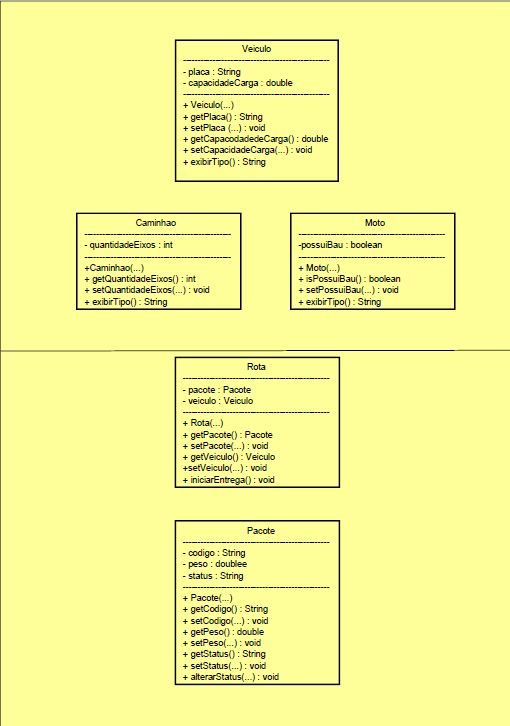

# Check Point 2 - FiapDelivery

Este projeto foi desenvolvido para a atividade de refatoração do sistema FiapDelivery.

A proposta foi pegar um código legado com vários problemas e reorganizar ele usando conceitos de orientação a objetos, deixando a estrutura mais correta, mais segura e mais fácil de entender.

## Diagrama UML

## Conceitos trabalhados
- Encapsulamento
- Herança
- Associação
- Construtores
- Clean Code

## O que foi melhorado
- Os atributos públicos foram trocados por privados
- Foi criada a classe `Veiculo` para evitar repetição de código
- As classes `Caminhao` e `Moto` passaram a herdar de `Veiculo`
- A classe `Rota` ficou mais flexível, podendo trabalhar com diferentes tipos de veículo
- Os nomes de atributos e métodos foram melhorados
- Foram adicionadas validações básicas

## Observação
A parte da estrutura e da modelagem foi concluída normalmente. A execução local ficou pendente por conta de ajuste no ambiente Java da máquina.

## Autor
Felipe Molonhoni
RM: 564395
